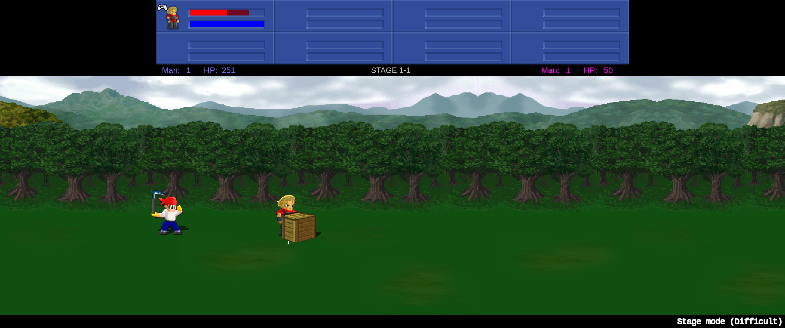
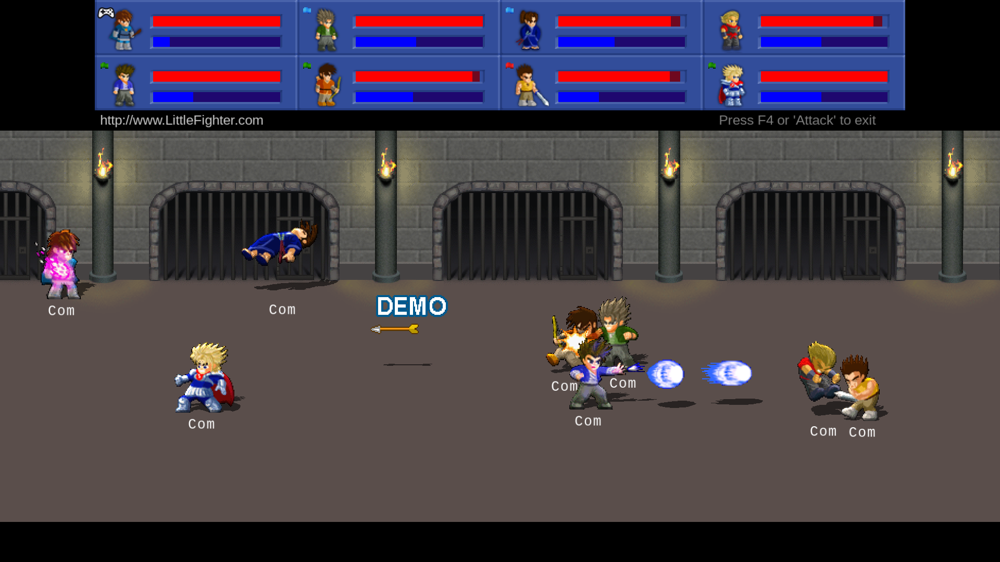
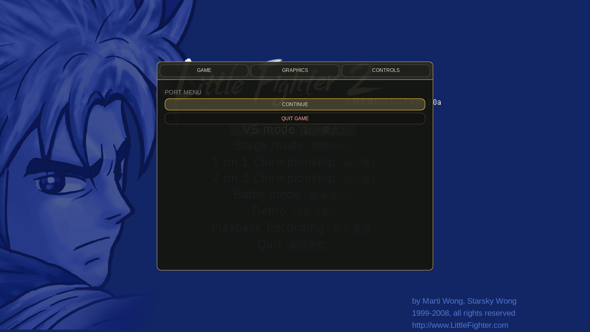
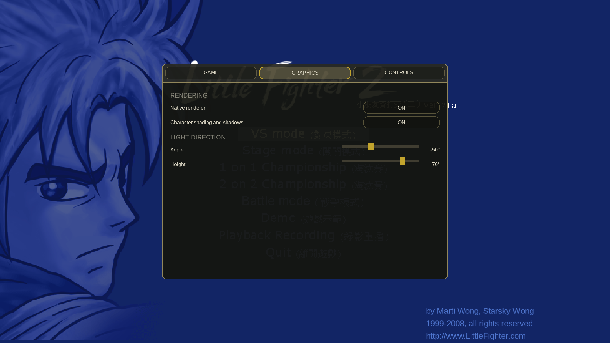
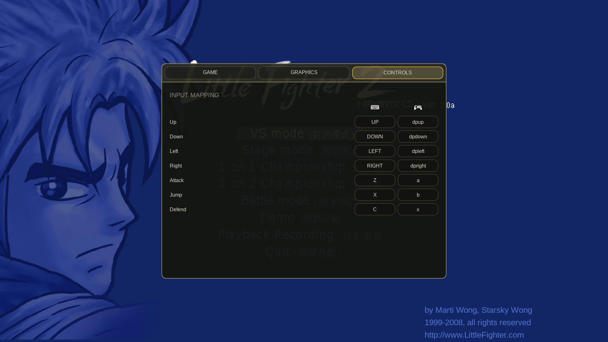

# lf2-port

A **native Linux/macOS port of Little Fighter 2 v2.0a** by static recompilation — the x86
binary is translated to C, and the Windows APIs it calls are reimplemented on SDL3. Along
the way it gains the quality-of-life features the original cannot support: controller
auto-detect and hotswap, and borderless windowed mode.

> **Status: it plays the game.** The port boots, renders, navigates the menus, starts a
> VS-mode match, and has sound effects and background music.
> See [`docs/codemap.md`](docs/codemap.md) for an honest per-subsystem status, including
> what is still broken.

## Screenshots



*Stage Mode PvE at 3440×1440: the ultrawide viewport exposes more of the stage while preserving
the original pixel geometry.*



*Native 16:9 presentation expands the world view instead of stretching the original 4:3 frame.*

| In-game port menu | Native renderer and lighting controls |
|---|---|
|  |  |



*Keyboard and controller bindings use the same device-independent input layer.*

These promotional screenshots were captured from a locally extracted copy of LF2. The game
executable and extracted assets are not distributed in this repository.

## No original game files are distributed here

This repository and its releases contain the port and its statically translated native program,
but **not** the original `lf2.exe`, installer, sprites, audio, or data. Little Fighter 2 is freeware
by **Marti Wong and Starsky Wong** and remains their copyright. To play, download the official
installer from <https://lf2.net> and extract it locally; the extracted tree is gitignored.

The curated promotional screenshots above are the only tracked visual output from the game;
they do not include or replace any separately usable game asset.

That applies to derivatives too. `re/instructions.tsv` — Ghidra's dump of every instruction
*with its raw bytes* — is gitignored for the same reason, since `.text` can be rebuilt from
it. Regenerate it from your own copy ([`docs/isa-scope.md`](docs/isa-scope.md)); the build
derives a substitute corpus when it is absent, so only the decoder-vs-Ghidra test skips.
What is kept is `re/entries.tsv` and `re/functions.tsv`: function addresses, sizes and
placeholder names, with no code in them.

This is an unofficial project with no affiliation with or endorsement by the LF2 authors.

## AppImage release

Download `LF2-Port-x86_64.AppImage` from a GitHub release, make it executable, and open it. On the
first launch, the port shows a native SDL setup dialog: choose `lf2.exe` inside a complete extracted
Little Fighter 2 v2.0a tree. The executable identity and the required sibling data are validated
before play, and the selected directory is remembered in the user's XDG configuration directory.

As a zero-configuration alternative, put the complete extracted tree in a directory named `game`
beside the AppImage:

```text
LF2-Port-x86_64.AppImage
game/lf2.exe
game/data/data.txt
```

Use the launcher's **Select Little Fighter 2 Game Files…** desktop action, or run the AppImage with
`--select-game`, to replace the saved location. The AppImage never copies or embeds the selected
game tree.

## Building and running

```sh
./run.sh
```

After installing the host build prerequisites listed below, that is the whole project setup.
`run.sh` is a slim `uv run --frozen` shim over `bootstrap.py`, which provisions everything the repo can own and
refuses by name — with the exact fix — when something is missing:

1. `port-assets` validated at `$PORT_ASSETS_DIR`, reused or provisioned below
   `$SHARED_DIR`, reused from the standard shared-repo layout when present, or
   cloned at a pinned revision into gitignored `scratch/deps`.
2. the pinned `third_party/RmlUi` and `third_party/lucent` submodules initialized when missing.
3. the Python environment synced by **uv** from the committed lockfile with `--frozen`
   (`pyproject.toml`; uv installs Python itself if the system one is old).
4. the game tree extracted from the installer (`tools/extract_game.py`, no
   Windows or Wine needed) — the installer is taken from `$LF2_INSTALLER`,
   then a copy beside the port, then downloaded from lf2.net.
5. the build via `tools/build/build.py` (skipped when the binary is current;
   `REBUILD=1 ./run.sh` forces it), then the game started from `game/`.

After `./run.sh` has provisioned the external checkouts, Python environment,
and game tree, the direct build/run path is:

```sh
uv run --frozen python tools/build/build.py
scratch/build-clang/lf2
```

Needs SDL3, `SDL3_ttf`, `SDL3_image` and cmake (plus a C11 and C++20 toolchain).
Agents verify with Clang; the project does not select or police the user's compiler.
Extraction needs only Python 3 standard library —
no Windows, no Wine. Background music additionally needs `ffmpeg` on PATH at
runtime (see below); everything else works without it.

The launcher resolves and validates the game tree, then enters it before starting the guest because
the game opens its data by relative path. Full details, including headless operation and the
debugging environment variables, are in [`docs/running.md`](docs/running.md).

## What works, and what doesn't

| | |
|---|---|
| Boot, menus, character select, a VS match | works |
| Rendering — DirectDraw, GDI text, colour-keyed sprites | works |
| Sound effects (DirectSound → SDL3) | works |
| Background music (WMA) | works, needs `ffmpeg` on PATH |
| Modern anti-aliased text | menu and character-select text, with required `SDL3_ttf` and embedded licensed fonts |
| Controller auto-detect and hotswap, no configuration | implemented, **untested on real hardware** |
| Two controllers, two players | works — second pad joins as Player 2, no configuration |
| Borderless / windowed / fullscreen, Alt+Enter | works |
| Linux | works |
| macOS | user-built; Metal shader support added after the shadow report, **re-test pending (#100)** |
| Android | **no release yet** — Activity/SAF setup, touch controls, and the real-device performance matrix are not implemented |
| Netplay | **not ported** — stubbed as "no network available" |

The controller row remains untested because no gamepad was available. The macOS row records a
real user build; its new Metal renderer path still needs the acceptance run in issue #100.

## Extracting the game files

The v2.0a installer is not Inno Setup or NSIS — it's a Win32 stub wrapping a custom `wwgT`
container. `tools/extract_game.py` reconstructs the full 690-file tree with no Windows
involved. Correctness is verified end to end: the game boots from the reconstructed tree.

The container format, including a deduplication trap that silently misaligns filenames
against their contents if you pair them naively, is documented in
[`docs/codemap.md`](docs/codemap.md).

## How it works

The recompiler decodes all 70,508 instructions of `lf2.exe` and emits one C function per
guest function — 100% of instructions lifted, no interpreter fallback. The runtime provides
a 4 GiB lazily-committed guest address space, lazy EFLAGS, x87 in host `double`, and
reimplementations of DirectDraw, DirectSound, DirectShow, GDI and the Win32 message loop on
SDL3. COM interfaces are synthesised as guest-memory vtables with sentinel addresses that
dispatch back into host C.

Correctness rests on differential testing against the host CPU: **8373 instruction
encodings × 8 rounds = 66,984 checks**, including x87, under **both gcc and clang**. Every
claim of the form "this is right" in the docs is expected to name the measurement behind
it, and several documented findings are corrections of earlier confidently-wrong ones.

Building under a second compiler is part of that, not housekeeping: it is what caught
`FSTP ST(i)` being emitted as `FST(i) = fpu_pop();`, which reads and modifies the FPU top
pointer unsequenced. Undefined behaviour that gcc happened to order correctly, so 66,984
passing checks said nothing about it.

### Notes from the reverse engineering

Full detail in [`docs/platform-boundary.md`](docs/platform-boundary.md) and
[`docs/isa-scope.md`](docs/isa-scope.md).

- **The porting surface is small.** An unpacked MSVC 2005 binary, 284 KB of code, ~130
  imported symbols, only 92 distinct mnemonics. `DirectDrawCreate` is the *only* DirectDraw
  import, so every other video call travels through COM vtables — which means the runtime
  gets to define them.
- **Part of every frame is drawn by GDI**, not DirectDraw. A naive "DirectDraw → texture"
  port silently loses the text rendering path.
- **Controller hotswap is impossible in the stock game by construction.** It enumerates
  joysticks once at startup, probes only device ids 0 and 1, and uses `joySetCapture` — a
  legacy API with no device-arrival notification. Replacing that surface is necessary but
  not sufficient: the game only consults a joystick for a player whose *control config*
  names one, so a correctly reimplemented `joyGetPosEx` can answer perfectly while a
  controller still does nothing. "Plug it in and play" needed the input gather ported.
- **Ghidra does not disassemble everything reachable**, so `re/instructions.tsv` is a lower
  bound. A live block using `FNSTCW` is absent from it entirely; "the binary contains no X"
  is not a conclusion that file can support.

## Repository layout

| Path | |
|---|---|
| `recompiler/` | x86 decoder and the x86 → C lifter |
| `runtime/` | guest machine, SDL3 backends, Win32/COM shims, test harnesses |
| `tools/` | installer unpacker, Ghidra scripts, analysis helpers |
| `docs/` | codemap, running guide, reverse-engineering notes |
| `re/` | Ghidra-derived function and instruction maps |
| `game/` | extracted game tree — **gitignored, supply your own** |

## Licence

[MIT](LICENSE).

This covers the tools, recompiler, runtime and documentation in this repository only. It
says nothing about Little Fighter 2 itself, which remains the copyright of Marti Wong and
Starsky Wong and is not distributed here.
