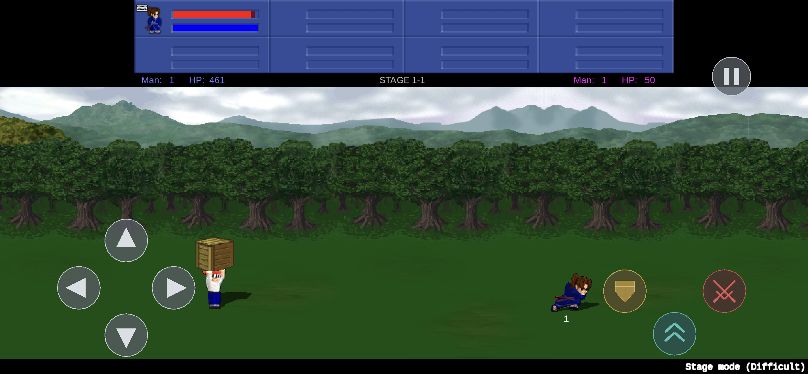

# lf2-port

A native Linux, macOS, and Android port of **Little Fighter 2 v2.0a**. The
target product keeps the port's native host systems and selected native game
behavior while `shared/x86port` dynamically translates every remaining x86-32
guest instruction from the player's original executable.

The repository is currently between execution architectures. Its native
renderer, platform services, UI, input, audio, packaging, and gameplay
enhancements exist, but the checked-in gameplay build still depends on the
retired offline x86-to-C pipeline. That pipeline is no longer a supported
product or oracle and must not be built or run. The current work is the
[native/JIT migration](docs/migration.md); capability truth is in
[project state](docs/project-state.md).

## Intended product

```text
authenticated lf2.exe
        |
native LF2 entry and bounded initialization
        |
LF2 runtime adapter -> x86port JIT -> translated blocks from live guest bytes
        |                    |
        |                    +-> LF2 native overrides by guest address
        +-> Win32 / CRT / DirectDraw / GDI / DirectSound HLE
                                      |
                        SDL3 host presentation, audio, input, and UI
```

There is no offline guest-code generation in the intended build. An x86
interpreter may be linked only into a separately built test target, including
diagnostic tests, for differential testing. Build-graph, link-map/symbol, and
selector inspection must prove it and its helper/fallback machinery are absent
from gameplay.

The CPU migration preserves the current Win32, DirectDraw, HLE, native-entry,
native-override, renderer, audio, input, and UI seams. It does not require a
graphics rewrite. See the [codemap](docs/codemap.md) for ownership.

## Feature state

The comparison baseline is the unmodified Windows LF2 v2.0a release. These are
the intended differences and their current state; IDs link the summary to the
canonical inventory.

| State item | Capability | State |
| --- | --- | --- |
| S001 | Boot, menus, VS Mode, and Stage Mode with audio | partial — established before migration; JIT re-conformance pending |
| S005 | Native overrides plus on-demand `x86port` JIT execution | missing |
| S006 | Widescreen/ultrawide adds world coverage without stretching | verified |
| S002, S007 | High-resolution pixel-art rendering, lighting, and cast shadows | verified |
| S003 | Persistent remappable keyboard/controller actions | partial — physical-hardware gate pending |
| S008, S009 | Two-controller local play and controller hot-plug | partial — physical-hardware gate pending |
| S010 | Borderless, windowed, fullscreen, and Alt+Enter modes | verified |
| S011 | Modern anti-aliased host text | verified |
| S004 | Linux AppImage first-run file selection | partial — clean-machine release gate pending |
| S012 | macOS native release | partial — Metal acceptance and JIT host gate pending |
| S013 | Android ARM64 release with touch and private setup | partial — ARM64 JIT and hardware gate pending |
| S014 | Original network play | missing |

The full inventory also tracks interpreter exclusion, generated-path removal,
representative gameplay conformance, and host JIT coverage in
[`docs/project-state.md`](docs/project-state.md).

## Screenshots from the preserved native host path



*Stage Mode with the authored Android touch layer.*


*Stage Mode at 3440×1440: the viewport exposes more stage area while preserving
the original pixel geometry.*


*A 16:9 world view rather than a stretched 4:3 frame.*

| In-game port menu | Native renderer and lighting controls |
| --- | --- |
|  |  |

These captures establish preserved host capabilities; they do not prove the
new JIT execution path until the representative-gameplay gate passes.

## Game files are not distributed

This repository and its releases must not contain `lf2.exe`, the original
installer, sprites, audio, data, or a reconstructable instruction-byte corpus.
Little Fighter 2 is freeware by **Marti Wong and Starsky Wong** and remains
their copyright. This is an unofficial project with no affiliation with or
endorsement by the authors.

The finished launcher accepts the player's LF2 v2.0a installer, a complete
extracted tree, or one bounded nested ZIP; validates exact executable and data
identity; and persists the accepted location in OS user data. The gameplay
runtime consumes the authenticated executable directly.

`re/instructions.tsv` remains gitignored because its raw-byte column can
reconstruct game code. Address/name metadata may be retained only where it has
an independent runtime, RE, or native-override use; lists that exist solely to
drive offline code generation are removed with that pipeline.

## Building and running

There is temporarily no supported gameplay build from this checkout. Do not
invoke the current `./run.sh`, generated-C build, or old end-to-end routes until
state item S005 replaces their execution owner. The eventual zero-argument
`./run.sh` remains the shipping interface: a slim `uv run --frozen` shim that
provisions player-owned assets, builds the native/JIT target, and launches it.
It will not run tests or expose an engine selector.

Documentation-only validation available during this planning milestone is
listed in [`docs/running.md`](docs/running.md). The first executable milestone
and the gate that restores product runs are specified in
[`docs/migration.md`](docs/migration.md).

## Repository layout

| Path | Responsibility |
| --- | --- |
| `runtime/app/` | native entry, lifecycle, game-file selection, configuration, user paths |
| `runtime/cpu/` | LF2 memory/PE ownership and the future adapter to `shared/x86port` |
| `runtime/win32/` | Win32, CRT, COM, DirectDraw, GDI, DirectShow, and socket/HLE services |
| `runtime/overrides/` | title-specific native behavior and runtime override registrations |
| `runtime/video/`, `runtime/audio/`, `runtime/input/`, `runtime/ui/` | native host subsystems |
| `platforms/` | package/platform composition |
| `tools/` | Python provisioning, verification, packaging, and RE tools |
| `docs/` | goals, state, migration, ownership, evidence, and RE notes |
| `re/` | non-code title metadata retained only for runtime/RE/native ownership |
| `game/` | player-owned extracted tree; gitignored |

`shared/x86port` owns x86 decoding, architectural state, interpreter tests,
dynamic translation, executable memory, and block caching. LF2 does not carry a
second implementation.

## Licence

[MIT](LICENSE) covers this repository's original code and documentation only.
It grants no rights to Little Fighter 2 or its assets.
